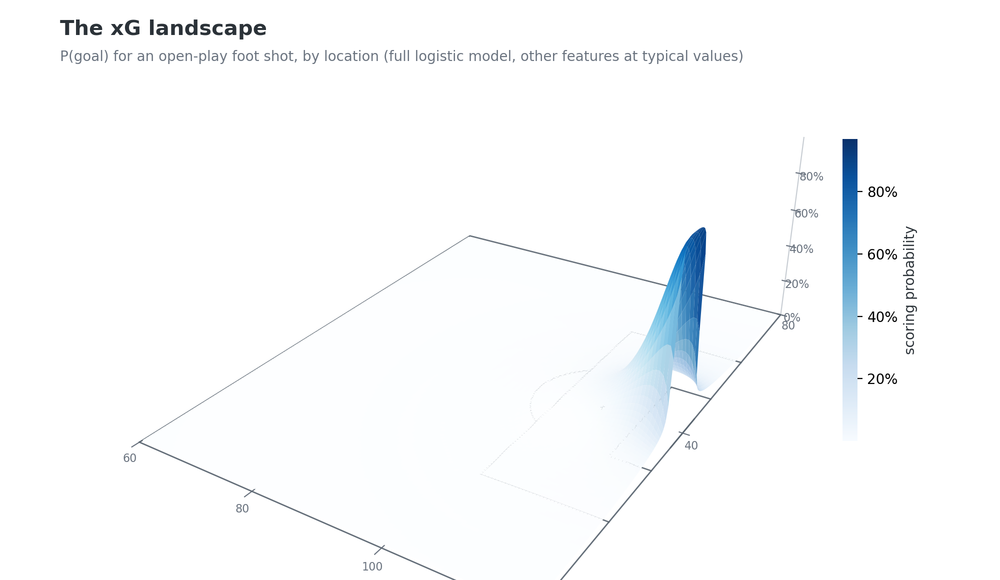
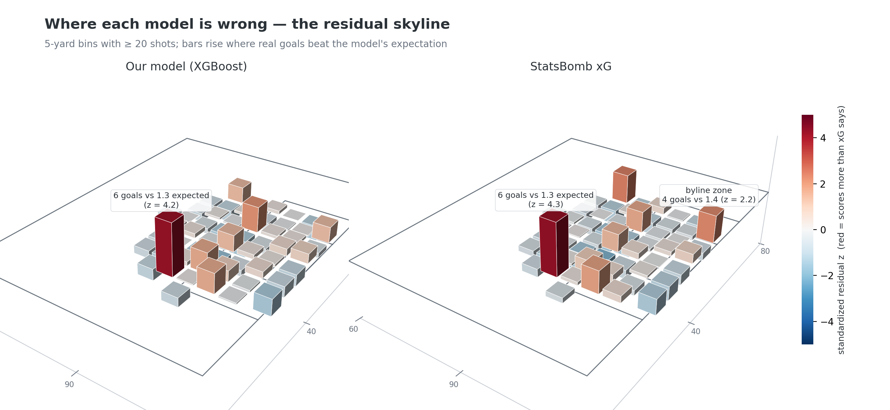
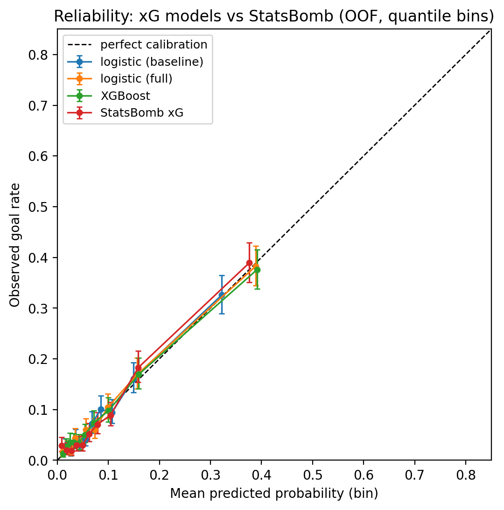
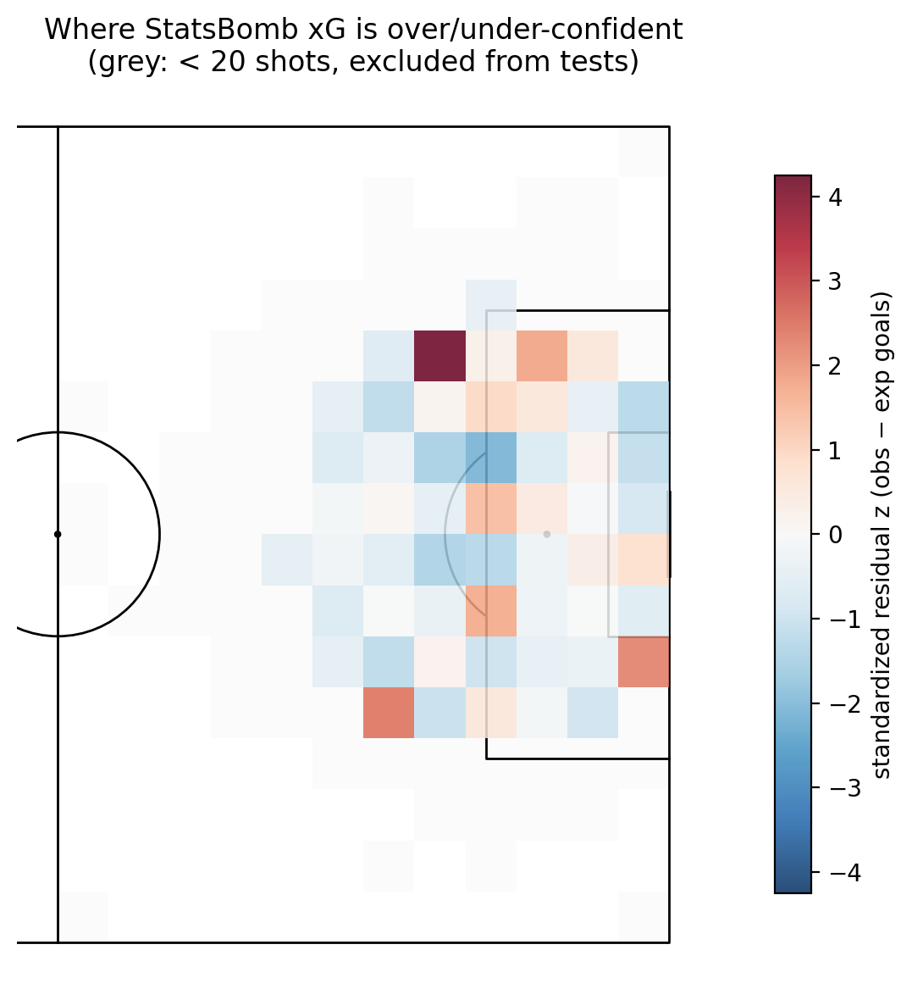

# An xG model from raw World Cup event data — and a map of where it's wrong

Most expected-goals projects stop at "I trained an xG model." This one asks the harder
question: **where on the pitch is the model systematically over- or under-confident, and
is that miscalibration statistically structured?** The same test battery is run on
StatsBomb's own commercial xG for comparison — and it, not our model, is the one that
shows a significant blind spot.

Built from raw StatsBomb event data (every shot with pitch coordinates and a full
freeze-frame of player positions) for four World Cups: men's 2018 & 2022, women's 2019 &
2023 — **5,957 non-penalty shots, 543 goals (9.1%), 244 matches**. The ongoing 2026 World
Cup is audited at match level from the public aggregate feed (see below).

## Key findings

1. **A simple model gets within 1.4% of the commercial one.** Out-of-fold log-loss:
   XGBoost 0.2492, full logistic 0.2480, vs StatsBomb xG 0.2458 — despite StatsBomb using
   proprietary features (shot height, GK micro-positioning) we don't observe.
2. **At 5-yard spatial granularity, neither model's residuals show significant structure**
   (spatial χ²: ours p = 0.354, StatsBomb p = 0.147; Moran's I is slightly *negative* —
   no clustering of miscalibration). With ~6k shots, pitch-location miscalibration is
   smaller than the sampling noise per cell.
3. **The structure is in shot *type*, not raw location — and it's StatsBomb's, not ours.**
   Tight-angle shots (< 15° goal-mouth angle, the "byline" zone) score significantly more
   than StatsBomb xG predicts: 38 goals observed vs 27.4 expected over 1,425 shots
   (z = +2.07, p = 0.039). Set-piece-phase shots trend the other way (95 vs 111.2,
   z = −1.73, p = 0.083). Our model passes every subgroup test (all |z| ≤ 1.26).
4. **Calibration is already tight, so recalibration hurts.** Cross-validated isotonic
   regression *worsens* OOF log-loss (e.g. XGBoost 0.2492 → 0.2586); the Brier
   reliability component is ≤ 0.0002 for every model. At World Cup sample sizes the
   models are calibration-limited by noise, not by bias.
5. **2026 World Cup (through 90 completed matches):** 261 goals vs 236.9 provider xG —
   teams are finishing ~10% above expectation, but not significantly (z = 1.57,
   p = 0.117), and match-level residuals are *under*-dispersed relative to Poisson
   (ratio 0.62), consistent with xG double-counting rebound sequences.



*The xG landscape: scoring probability is essentially flat until the edge of the
six-yard box, then goes vertical — most of the attacking half is statistical
wilderness.*



*The residual skyline: bars rise where real goals beat the model's expectation.
Both models share one anomaly (a long-range cell where 6 screamers beat ~1.3
expected goals), but only StatsBomb's panel grows a tower in the byline zone —
the tight-angle blind spot behind finding 3.*

| | |
|---|---|
|  |  |

## Data

- **[StatsBomb Open Data](https://github.com/statsbomb/open-data)** — full event data
  (JSON) for FIFA World Cup 2018/2022 and Women's World Cup 2019/2023, pulled via
  [`statsbombpy`](https://github.com/statsbomb/statsbombpy). Every shot carries pitch
  coordinates (x ∈ [0, 120], y ∈ [0, 80]), body part, technique, and a **freeze-frame**
  of all player positions at the moment of the shot (100% coverage in this sample).
  Penalties (235) are excluded — they are a near-constant ~0.78 probability event that
  would distort the spatial analysis.
- **[FIFA World Cup 2026 Dataset](https://github.com/mominullptr/FIFA-World-Cup-2026-Dataset)**
  (CC0, updated daily during the tournament) — match-level scores and provider xG. This
  feed has **no shot coordinates**, so 2026 is analysed at the granularity the data
  supports: match-level calibration of the provider's xG.

## Method

**Features** (`src/features.py`): distance to goal centre; visible goal-mouth angle (law
of cosines between the posts); body part; first-time / volley / under-pressure flags;
set-piece context; assist type (cross, cutback, through-ball, recovered from the key-pass
event); and freeze-frame geometry — defenders inside the shot→posts cone, distance to
nearest opponent, GK depth, GK lateral offset from the shot line, GK-in-cone.

**Models** (`src/models.py`): baseline logistic (distance + angle + header), full
logistic, and XGBoost (small grid over depth × learning rate; best: depth 2, lr 0.03 —
the data prefer a heavily regularized model). Validation is **GroupKFold by match** so
every prediction is out-of-fold and no shot is scored by a model that saw its match.
Metric CIs are cluster-bootstrapped over matches (2,000 resamples).

| model | log-loss (95% CI) | Brier | AUC (95% CI) |
|---|---|---|---|
| logistic (baseline) | 0.2654 (0.2480–0.2831) | 0.0739 | 0.758 (0.736–0.779) |
| logistic (full) | 0.2480 (0.2314–0.2660) | 0.0694 | 0.798 (0.778–0.818) |
| XGBoost | 0.2492 (0.2320–0.2669) | 0.0693 | 0.791 (0.771–0.810) |
| StatsBomb xG | 0.2458 (0.2302–0.2621) | 0.0676 | 0.802 (0.782–0.822) |

The full logistic model matching XGBoost is itself a finding: at ~6k shots with strong
geometric features, the extra capacity of boosting buys nothing.

Top XGBoost features by gain: GK-in-cone (0.185), goal-mouth angle (0.170), defenders in
cone (0.093), distance (0.092), GK depth (0.090) — the freeze-frame is doing real work.

**Residual analysis** (`src/residuals.py`): the attacking area (x ≥ 60) is binned into
5×5-yard cells. Under calibration, each bin's goal count is Poisson-binomial:
E = Σpᵢ, Var = Σpᵢ(1−pᵢ), giving standardized residuals z. Tests use the 54 bins with
≥ 20 shots (5,680 of 5,954 shots, 95.4% coverage):

- **Spatial χ²** (Hosmer–Lemeshow over spatial bins): ours 57.3 (df 54, p = 0.354);
  StatsBomb 64.9 (df 54, p = 0.147).
- **Moran's I** on bin residuals, queen contiguity, 9,999 permutations: ours −0.093
  (p = 0.875), StatsBomb −0.071 (p = 0.782); null expectation −0.019.
- **Subgroup z-tests**: headers vs feet, tight-angle zone, set-piece vs open play, and
  per-tournament — see `results/tables/subgroup_tests.csv` (key results above).

**2026 audit** (`src/wc2026.py`): calibration-in-the-large z-test with Poisson variance,
per-team-match dispersion test, binned xG-vs-goals reliability, and a per-team
over/under-performance table (`results/tables/wc2026_team_performance.csv`; no team
individually significant at p < 0.05 through 90 matches).

## Reproduce

```bash
pip install -r requirements.txt
pytest tests/                          # 15 tests: geometry + statistical machinery
python scripts/01_build_dataset.py     # ~250 HTTP fetches, cached in data/raw/
python scripts/02_train_models.py      # tuning + OOF predictions + metrics
python scripts/03_calibration.py       # reliability, Brier decomposition, isotonic
python scripts/04_residual_maps.py     # z-maps, spatial chi-square, Moran's I, subgroups
python scripts/05_wc2026_analysis.py   # 2026 match-level audit (--refresh for latest)
python scripts/06_3d_visuals.py        # 3D xG landscape + residual skyline
```

Deterministic given the data: seed, folds, grid and permutation counts live in
`config.py`. All statistics land in `results/tables/`, all figures in `results/figures/`.

**Adding the 2026 World Cup at shot level:** StatsBomb has historically released World
Cup event data days after the final (the 2026 final is July 19). When it lands, append
`(43, <season_id>, "Men's WC 2026")` to `TOURNAMENTS` in `config.py` and re-run scripts
01–04.

## Layout

```
config.py            tournaments, pitch grid, seed, test parameters
src/data.py          StatsBomb download → data/shots.parquet (serial by design; cached)
src/features.py      geometry + freeze-frame feature engineering
src/models.py        logistic models, XGBoost, GroupKFold OOF machinery
src/evaluate.py      bootstrap metric CIs, reliability, Brier decomposition, isotonic CV
src/residuals.py     pitch binning, spatial χ², Moran's I, subgroup tests
src/wc2026.py        2026 match-level calibration audit
src/plots.py         reliability + pitch heatmap figures
src/plots3d.py       3D xG landscape surface and residual skyline
scripts/01..06       the pipeline, in order
tests/               geometry and statistics unit tests (synthetic known answers)
results/             tables (CSV) and figures (PNG) — committed
data/                local cache — gitignored, rebuilt by scripts 01/05
```

## Limitations

- One-stage XGBoost tuning on the same folds used for reporting induces mild optimism;
  the 9-point grid and the logistic-parity result bound how much.
- The 2026 provider xG methodology (penalty/own-goal treatment) is undocumented; its
  audit measures *that feed's* calibration, not our model's.
- The subgroups were fixed before looking at results, but the tight-angle finding
  (p = 0.039) is one of ~10 comparisons per model; it would not survive a strict
  Bonferroni correction and should be read as strong-suggestive, replicating the
  known hard-for-xG byline regime.

## Attribution

Shot-level data © [StatsBomb](https://statsbomb.com/) — released for research and
education under the [StatsBomb Open Data licence](https://github.com/statsbomb/open-data/blob/master/LICENSE.pdf);
this project is non-commercial and credits StatsBomb as the data source. 2026 aggregate
data from [mominullptr/FIFA-World-Cup-2026-Dataset](https://github.com/mominullptr/FIFA-World-Cup-2026-Dataset)
(CC0 1.0).
